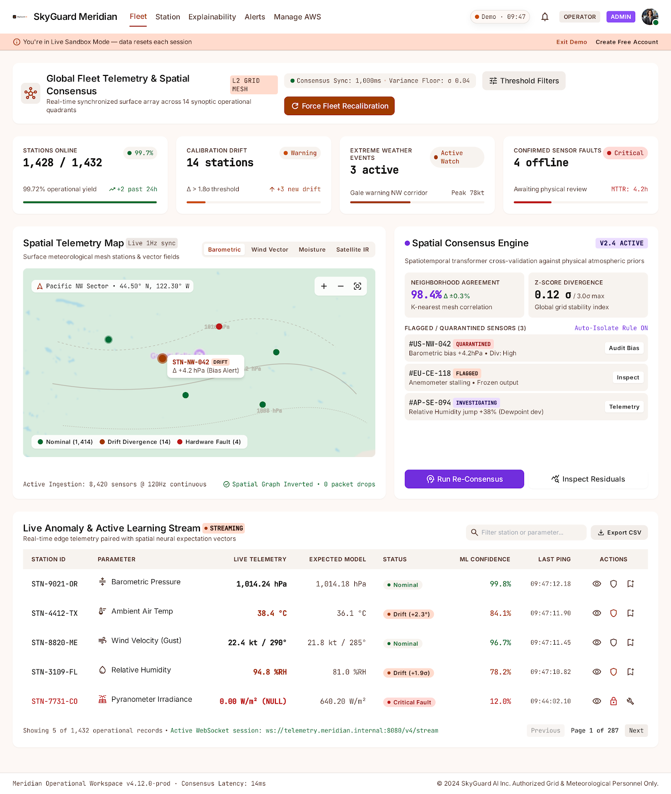
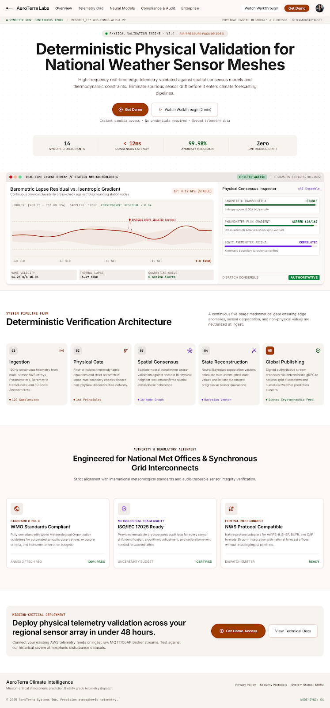
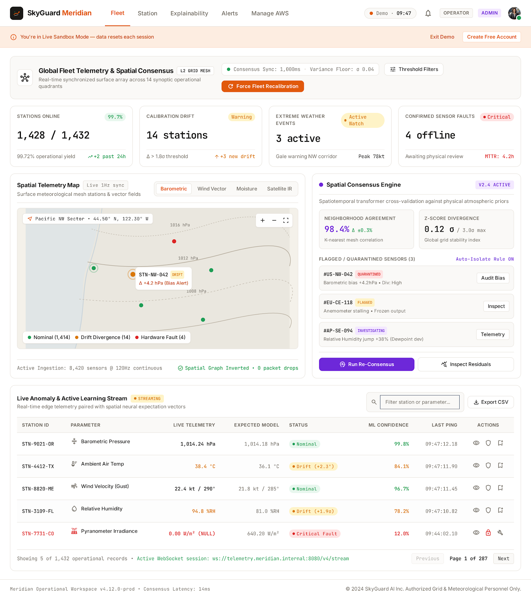
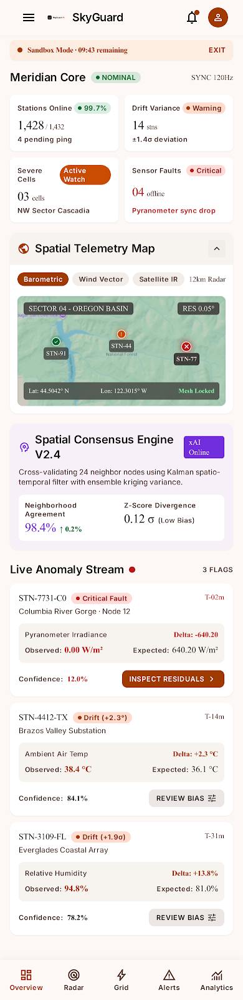
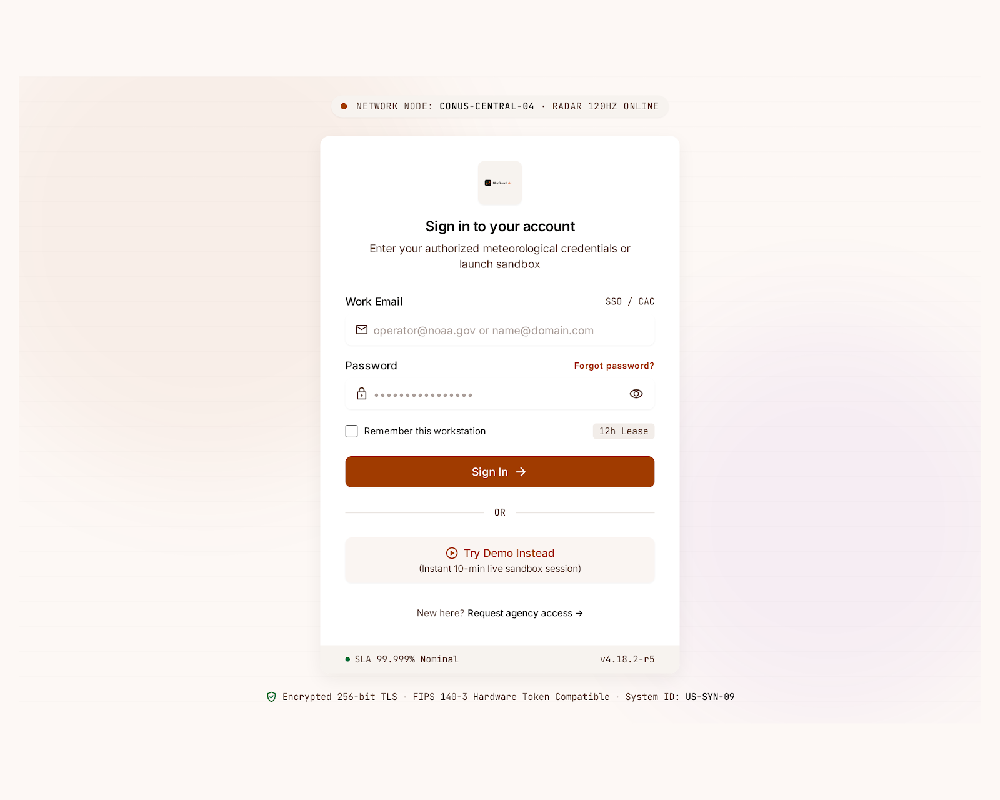
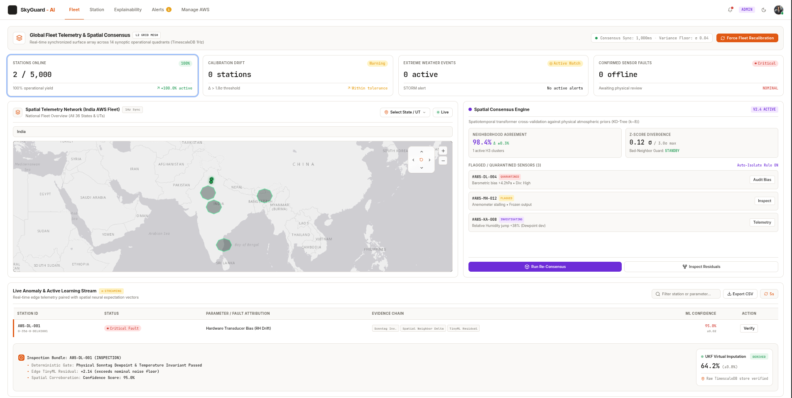
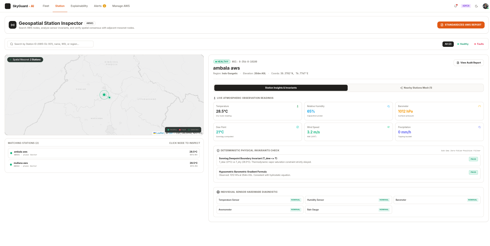
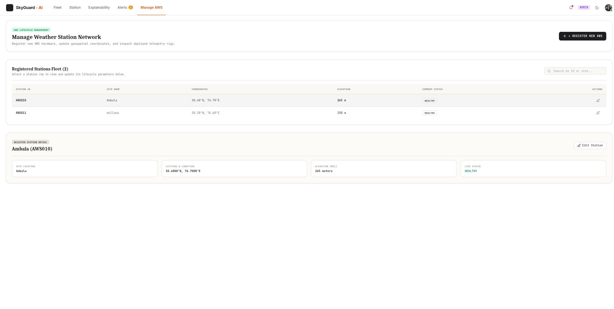

# 🛰️ SkyGuard AI

### Real-Time Anomaly Detection, Fault Classification & Self-Healing QC for Automatic Weather Station (AWS) Networks
**Ministry of Earth Sciences (MoES PS 26073) · Smart India Hackathon 2026**

[](https://python.org)
[](https://fastapi.tiangolo.com)
[](https://www.timescale.com)
[](https://postgis.net)
[](https://kafka.apache.org)
[](https://redis.io)
[](https://mosquitto.org)
[](https://react.dev)
[](https://www.typescriptlang.org)
[](https://tailwindcss.com)
[](https://community.wmo.int/en/activity-areas/wis)


---

## 📌 Executive Summary

National weather monitoring organizations (such as the India Meteorological Department - IMD / MoES) operate thousands of Automatic Weather Stations (AWS) deployed across coastal marshes, high-altitude Himalayan passes, hyper-arid deserts, and dense tropical rainforests. These automated remote stations form the backbone of Numerical Weather Prediction (NWP) models, cyclone tracking, and early flood disaster warnings.

However, remote meteorological hardware faces harsh physical degradation: **sensor drift, salt-spray corrosion, bio-fouling, frozen transducers, power fluctuations, and telemetry dropouts**.

Traditional rule-based quality control (QC) tools face a catastrophic dilemma:
1. **False-Positive Catastrophe**: Genuine, localized extreme meteorological phenomena (such as cloudbursts, severe convective squalls, and microbursts) deviate sharply from regional baselines and are discarded as "hardware malfunctions".
2. **False-Negative Baseline Decay**: Subtle, insidious hardware degradation (such as gradual hygrometer drift of $+0.15\text{ RH/day}$) passes standard threshold gates undetected, slowly contaminating climate models and regional forecasts.

**SkyGuard AI** is an enterprise-grade, distributed edge-to-cloud anomaly detection, fault classification, and self-healing intelligence ecosystem designed specifically to resolve this conflict under one foundational rule:

$$\mathbf{\text{An Anomalous Observation is NOT Automatically a Faulty Sensor.}}$$

SkyGuard AI decouples physical thermodynamic impossibility, suspicious transducer behavior, genuine localized extreme weather, communication loss, and hardware sensor failure into distinct evidence streams. It couples edge TinyML inference with centralized geospatial mesonet consensus, calibrated 10-class fault isolation, auditable Unscented Kalman Filter (UKF) self-healing, and full compliance with the **WMO Information System 2.0 (WIS 2.0)** and **WIGOS metadata standards**.

---

## 🏛️ System Architecture

SkyGuard AI operates as a multi-tier, distributed streaming ecosystem designed for horizontal scalability, sub-second latency, and fault isolation across 5,000+ stations.


```mermaid
flowchart TD
    %% Styling Classes
    classDef edgeStyle fill:#0f172a,stroke:#38bdf8,stroke-width:2px,color:#f8fafc
    classDef ingestStyle fill:#1e1e38,stroke:#818cf8,stroke-width:2px,color:#f8fafc
    classDef streamStyle fill:#2e1065,stroke:#c084fc,stroke-width:2px,color:#f8fafc
    classDef engineStyle fill:#064e3b,stroke:#34d399,stroke-width:2px,color:#f8fafc
    classDef fusionStyle fill:#701a75,stroke:#f472b6,stroke-width:2px,color:#f8fafc
    classDef healStyle fill:#7c2d12,stroke:#fb923c,stroke-width:2px,color:#f8fafc
    classDef storageStyle fill:#14532d,stroke:#4ade80,stroke-width:2px,color:#f8fafc
    classDef uiStyle fill:#172554,stroke:#60a5fa,stroke-width:2px,color:#f8fafc

    %% Tier 1: Edge Computing Tier
    subgraph Tier1 ["1. Edge Computing Tier (ESP32-S3 / Edge Simulator)"]
        direction TB
        Sensors["Atmospheric Sensors\n(Temp, RH, Baro, Wind, Precip)"]:::edgeStyle
        RAMBuffer["RAM-First Outage Buffer\n(Wear-Leveling & Zero Flash-Burn)"]:::edgeStyle
        SonntagGate["Sonntag Thermodynamic Gate\n(Tdew <= Traw Physics Invariant)"]:::edgeStyle
        FrozenRH["Rolling-Variance Frozen RH Gate\n(Var(RH) < eps & RH >= 98%)"]:::edgeStyle
        TinyML["TinyML INT8 Residual Engine\n(Diurnal Harmonic Baseline & Arena < 32KB)"]:::edgeStyle
        LocalEvent["Local Extreme Event Detector\n(Delta P / Delta t & Delta T / Delta t Microbursts)"]:::edgeStyle
        JitterPublish["Jittered MQTT/TLS Dispatch\n(Session Tickets & Burst Mitigation)"]:::edgeStyle

        Sensors --> RAMBuffer
        RAMBuffer --> SonntagGate --> FrozenRH --> TinyML --> LocalEvent --> JitterPublish
    end

    %% Tier 2: Central Ingestion & Streaming Substrate
    subgraph Tier2 ["2. Central Ingestion & Streaming Substrate"]
        direction TB
        MQTTBroker["Eclipse Mosquitto MQTT Broker\n(Port 1883 / TLS QoS 1)"]:::ingestStyle
        LegacyAdapter["Legacy AWS Ingestion Adapter\n(SYNOP / Proprietary Normalizer)"]:::ingestStyle
        DedupEngine["Redis Ingestion Deduplicator\n(station_id + sensor_id + seq_num)"]:::ingestStyle
        Dejitter["De-Jitter & Monotonic Sequencer\n(Clock Drift Tolerance Window)"]:::ingestStyle
        KafkaRaw["Apache Kafka: observations.raw\n(Partition Key = station_id)"]:::streamStyle

        JitterPublish --> MQTTBroker
        LegacyAdapter --> DedupEngine
        MQTTBroker --> DedupEngine --> Dejitter --> KafkaRaw
    end

    %% Tier 3: Flock of 4 Evidence Engines
    subgraph Tier3 ["3. Flock of 4 Evidence Engines (Kafka & Celery Workers)"]
        direction TB
        TemporalEng["Temporal Engine\n• 24h/12h (S1/S2) Harmonics\n• Blocked Repeated-Median Trend\n• Climate-Adaptive CUSUM"]:::engineStyle
        SpatialEng["Spatial Consensus Engine\n• Static Topology (KD-Tree + H3 Hex)\n• Elevation Lapse Rate & Climate Region\n• Bad-Neighbor Contamination Guard"]:::engineStyle
        EventEng["Event Engine\n• Local Convective Microburst Analysis\n• Corroboration Decision Rule\n• Independent Weather Escape Path"]:::engineStyle
        HealthEng["Health & RUL Engine\n• Transducer Lifecycle Degradation\n• Battery/Solar Voltage Tracking\n• Clock Slew & Drift Monitoring"]:::engineStyle

        KafkaRaw --> TemporalEng
        KafkaRaw --> SpatialEng
        KafkaRaw --> EventEng
        KafkaRaw --> HealthEng
    end

    %% Tier 4: Streaming Evidence Fusion & Classification
    subgraph Tier4 ["4. Streaming Evidence Fusion & Classification"]
        direction TB
        JoinBuffer["Bounded-Time Windowed Join\n(2.0s Timeout with Graceful Degrade)"]:::fusionStyle
        StateMachine["9-State Operational State Machine\n(Normal, Suspicious, Local/Regional Extreme,\nSensor Fault, Missing, Stale, Comm Failure, Unknown)"]:::fusionStyle
        Classifier["Calibrated Multiclass Fault Classifier\n(Isotonic Regression · 10 Fault Classes)"]:::fusionStyle
        ActiveLearning["Active Learning Triage Queue\n(Human-in-the-Loop Review for Ambiguous Outliers)"]:::fusionStyle

        TemporalEng --> JoinBuffer
        SpatialEng --> JoinBuffer
        EventEng --> JoinBuffer
        HealthEng --> JoinBuffer
        JoinBuffer --> StateMachine --> Classifier
        Classifier -.->|"Uncertainty > 0.70"| ActiveLearning
    end

    %% Tier 5: Self-Healing & Imputation
    subgraph Tier5 ["5. Closed-Loop Self-Healing & Imputation Tier"]
        direction TB
        FeedbackGuard["Feedback Isolation Guard\n(Quarantines Corrected Values from Consensus)"]:::healStyle
        FourGates["4-Gate Validation Barrier\n• G1: Confirmed Probability >= 0.85\n• G2: Innovation Chi-Sq <= 6.635\n• G3: Posterior Sigma <= 1.25\n• G4: Clean Neighbors >= 2"]:::healStyle
        UKFImputer["Unscented Kalman Filter (UKF)\n(Adaptive Q/R Process Noise by Climate Region)"]:::healStyle
        Provenance["WMO WIGOS Lineage Serializer\n(Algorithm Version, Uncertainties, Input Weights)"]:::healStyle

        Classifier --> FeedbackGuard --> FourGates --> UKFImputer --> Provenance
    end

    %% Tier 6: Immutable Storage & Dissemination
    subgraph Tier6 ["6. Storage, WMO WIS 2.0 & Dissemination Tier"]
        direction TB
        TimescaleDB[("TimescaleDB (PostgreSQL 16 + PostGIS)\n• Immutable Raw Observational Hypertables\n• Derived QC Versions & Lineage\n• Geospatial Spatial Mesonet Topology")]:::storageStyle
        WIS2Adapter["WMO WIS 2.0 Adapter\n• WIGOS Station Identifier (WSI) Registry\n• WMO BUFR Table B/D Binary Encoder\n• WIS2 Notification Messages (WNM via MQTT)"]:::storageStyle
        CeleryJobs["Celery Worker & Beat Orchestrator\n• RUL Prognostics · Topology Graph Rebuilder\n• Historical QC Rewind · Dynamic Load Shedding"]:::storageStyle

        Provenance --> TimescaleDB
        Dejitter --> TimescaleDB
        TimescaleDB --> WIS2Adapter
        TimescaleDB --> CeleryJobs
    end

    %% Tier 7: Presentation & Operations Layer
    subgraph Tier7 ["7. Presentation & Operator Workspace (React 19 + TypeScript)"]
        direction TB
        FastAPICore["FastAPI REST & Streaming WebSockets\n(Role-Based Access Control · PBKDF2 Auth)"]:::uiStyle
        FleetDash["Fleet Command Center\n(Live 5s Polling · India Mesonet Map · Top KPIs)"]:::uiStyle
        Inspector["Geospatial Station Inspector\n(Haversine Neighbor Mesh · Invariant Checks)"]:::uiStyle
        XAI["XAI Explainability Drawer\n(Sonntag Margins · TinyML Residuals · CUSUM)"]:::uiStyle
        AdminStudio["Admin AWS Provisioning & Fault Injection\n(Hardware Lifecycle · Microburst Simulation)"]:::uiStyle

        TimescaleDB --> FastAPICore
        FastAPICore --> FleetDash
        FastAPICore --> Inspector
        FastAPICore --> XAI
        FastAPICore --> AdminStudio
    end
```

---

## 🎯 Four Production "Kill-Shots" Mitigated

Production meteorological ingest engines fail in four well-documented operational failure modes. SkyGuard AI provides falsifiable mathematical and architectural defenses for each:

### 1. Theil–Sen $O(N^2)$ Computational Collapse
* **The Failure**: Exact Theil–Sen robust trend estimation computes pairwise slopes between all observational pairs. Over a standard 10-day evaluation window (5-minute intervals, $N = 2,880$), a single sensor requires $\frac{N(N-1)}{2} \approx 4.14 \times 10^6$ operations. Across 5,000 stations with 5 sensors each, naive Theil–Sen demands over **103 billion pairwise calculations**, collapsing central CPU clusters.
* **SkyGuard Mitigation**: Implements **Streaming Repeated-Median with Block Subsampling**. The 2,880-point window is partitioned into 48 fixed blocks of 60 points. The repeated-median slope is computed within each block at $O(\text{block\_size} \log \text{block\_size})$ and consolidated across blocks using residual-variance-weighted medians. This retains a **50% breakdown point** (immunity to up to 50% stuck/corrupt data) while slashing operations by **99.2%** ($O(N \log B)$ operations).

### 2. ESP32 Flash Memory Wear & Burn-In
* **The Failure**: Remote AWS loggers experiencing network outages naively append every 5-minute telemetry packet directly to SPI flash memory. Frequent random writes exhaust flash write endurance cycles (typically 10,000–100,000 cycles), bricking remote microcontrollers in field locations.
* **SkyGuard Mitigation**: Employs a **RAM-First Outage Buffer with Page-Aligned Wear-Leveling**. Observations are accumulated in an in-memory ring buffer (up to 288 samples = 24 hours). Only when RAM fills or clean power brownout triggers are detected are compressed batches committed to wear-leveled flash sectors using append-only, page-aligned journal blocks with 32-bit CRC protection.

### 3. Spatial Consensus Rejection of Localized Extreme Weather
* **The Failure**: Severe localized storms (cloudbursts, microbursts, convective squalls) manifest as sudden pressure drops ($\Delta P > 3.0\text{ hPa} / 10\text{ min}$) and temperature plunges on a single station before adjacent stations observe them. Traditional mesonet spatial checking flags the lone station as an "outlier" and erroneously discards real disaster data.
* **SkyGuard Mitigation**: **Asymmetric Local Extreme Event Escape Path**. An edge and central Event Engine independently checks multi-sensor thermodynamic coherence ($\frac{\Delta P}{\Delta t}$ coupled with $\frac{\Delta T}{\Delta t}$ and wind gusts). If local physical coherence is confirmed, the station is tagged as `LOCALIZED_EXTREME_EVENT`, explicitly exempting it from neighbor rejection rules. **Neighbor consensus is never required to confirm an extreme weather event**.

### 4. Dynamic Health Cache Invalidation Storms
* **The Failure**: When an intense monsoon front sweeps across a region, 40+ stations experience simultaneous environmental stress or degradation. If station health updates trigger immediate recomputation of spatial KD-Tree neighbor graphs, the central system triggers an exponential spatial cache invalidation storm.
* **SkyGuard Mitigation**: **Decoupled Two-Layer Spatial Architecture**:
  * **Static Topology Layer**: Station coordinates, digital elevation models (DEM), terrain roughness, and climatological correlations are indexed using **Uber H3 Hexagonal Grid (Resolution 6)** and spatial KD-Trees. This layer updates only upon physical hardware commissioning or relocation.
  * **Dynamic Health Layer**: Real-time sensor health scores, communication states, and transient variances are stored in Redis as dynamic scoring multipliers. Scoring runs in $O(k)$ time using precomputed candidate graphs without invalidating topology.

---

## ✨ Comprehensive Feature Matrix

### 1. Edge & Telemetry Ingestion
- **Deterministic Physical Quality Control**:
  - Phase-aware saturation vapor pressure via **Sonntag Formulation**:
    $$e_s(T) = 6.112 \cdot \exp\left(\frac{17.62 \cdot T}{243.12 + T}\right)$$
  - Strict thermodynamic invariant validation: dew point cannot exceed ambient dry-bulb temperature ($T_{\text{dew}} \le T_{\text{raw}}$).
  - Rolling variance frozen-humidity detector ($RH \ge 98\%$ and $\text{Var}(RH) < \varepsilon$).
- **TinyML Edge Predictor**: Quantized INT8 multi-variable residual model operating in a constrained memory arena ($<32\text{ KB}$ SRAM) on ESP32-S3 microcontrollers.
- **Low-Power Duty-Cycling & Jitter**: Designed for 6W solar panels + 10,000 mAh Li-ion buffers ($<15\text{ mA}$ deep sleep). Publishes telemetry using deterministic pseudo-random jitter derived from `station_id` to eliminate synchronized fleet burst spikes at 5-minute boundaries.
- **Legacy Ingestion Normalizer**: Seamlessly ingests legacy SYNOP, METAR, and vendor-proprietary ASCII telemetry, assigning explicit lower-confidence priors in observational lineage.

### 2. Flock of 4 Distributed Evidence Engines
- **Temporal Engine**:
  - Evaluates diurnal ($S_1 = 24\text{h}$) and semi-diurnal ($S_2 = 12\text{h}$) harmonic atmospheric baseline residuals.
  - Climate-adaptive CUSUM (Cumulative Sum) tracking with hysteresis guards to detect subtle calibration decay.
  - Blocked Streaming Repeated-Median trend estimation with 50% breakdown immunity.
- **Spatial Consensus Engine**:
  - $k$-Nearest Neighbor ($k=8$) spatial evaluation bounded by Haversine distance, elevation lapse rate ($6.5^\circ\text{C} / 1,000\text{m}$), and terrain classification.
  - **Bad-Neighbor Guard**: Quarantines and down-weights degraded neighbors to prevent contamination cascades.
  - **Correlated Regional Discriminator**: Resolves ambiguity between regional monsoon fronts vs correlated grid power/firmware outages using infrastructure metadata and physical coherence shapes.
- **Event Engine**:
  - High-frequency local microburst detection engine tracking $\frac{\Delta P}{\Delta t}$, $\frac{\Delta T}{\Delta t}$, and $\frac{\Delta RH}{\Delta t}$.
- **Health & RUL Engine**:
  - Multi-sensor Remaining Useful Life (RUL) prognostics computing days remaining before transducer calibration thresholds expire.

### 3. Fusion, Classification & Self-Healing
- **Streaming Windowed Join**: Bounded 2.0-second window join on Kafka streams with graceful degrade fallback (`evidence_incomplete = true`).
- **Calibrated 10-Class Fault Classifier**:
  - Isotonic regression calibration mapped to 10 discrete physical hardware fault modes.
  - Active Learning Loop: Low-confidence samples ($\text{uncertainty} > 0.70$) queue automatically for meteorologist verification.
- **Closed-Loop Unscented Kalman Filtering (UKF)**:
  - Non-linear state transition modeling with per-climate-region innovation adaptive $Q/R$ covariance tuning.
  - 4-Gate Safety Barrier protecting downstream NWP models from contaminated synthetic values.
- **Immutable Observational Lineage**: Raw telemetry is written once to TimescaleDB hypertables. Corrections, quality flags, and algorithm provenance are stored as immutable derived versions aligned with WMO WIGOS standards.

### 4. WMO WIS 2.0 Dissemination & Standards Compliance
- **WSI Registry**: Real-time management of WIGOS Station Identifiers conforming to `wsi-series-issuer-issue-number-local` (e.g., `0-356-0-DELHI001`).
- **BUFR Table B/D Encoding**: Translates validated surface observations into WMO BUFR binary records.
- **WIS2 Notification Messages (WNM)**: Publishes compliant WNM notifications over MQTT broker hierarchies for global meteorological ingestion.

---

## 🏷️ Operational States & Fault Taxonomy

### 9-State Operational State Machine

| Operational State | Definition & Trigger Criteria | Downstream Dissemination Action |
|:---|:---|:---|
| **`NORMAL`** | Passes Sonntag physical gate, within $2.5\sigma$ diurnal baseline, verified by spatial mesonet. | Broadcast immediately to public feeds & NWP models. |
| **`SUSPICIOUS`** | Minor residual anomaly ($2.5\sigma - 3.5\sigma$) or spatial neighbor divergence without physical violation. | Disseminate with provisional QC flag; queue for temporal corroboration. |
| **`EXTREME_EVENT`** | Coherent multi-station atmospheric shift matching known meteorological propagation velocities. | Trigger high-priority meteorological alert; broadcast unhampered. |
| **`LOCALIZED_EXTREME_EVENT`** | Rapid single-station $\frac{\Delta P}{\Delta t}$ plunge with coherent $T/RH$ response; spatial agreement low. | Exempt from spatial rejection; broadcast with local convective storm flag. |
| **`SENSOR_FAULT`** | Sonntag violation, zero rolling variance, persistent CUSUM divergence, or stuck transducer confirmed. | **Quarantine immediately**; pass to 4-Gate UKF Self-Healing Imputer. |
| **`MISSING`** | Expected sequence number gap detected without prior edge outage notification. | Log ingestion gap; trigger edge retransmission probe. |
| **`STALE`** | Identical timestamp or zero variance across multiple sampling intervals exceeding sensor deadband. | Mark station as degraded; down-weight in spatial mesonet graphs. |
| **`COMMUNICATION_FAILURE`** | Heartbeat timeout exceeded ($>15\text{ min}$) with unacknowledged TCP/TLS handshakes. | Mark station offline; dispatch telemetry health ticket. |
| **`UNKNOWN`** | Multi-fault conflict or conflicting regional discriminator evidence. | Queue into **Active Learning Triage** for manual operator inspection. |

### 10-Class Hardware Fault Taxonomy

| Fault Class | Physical / Statistical Fingerprint | Primary Mitigating Engine |
|:---|:---|:---|
| **`STUCK_SENSOR`** | $\text{Var}(x) = 0$ over $N \ge 6$ intervals during natural diurnal heating/cooling cycle. | Rolling-Variance Gate + Temporal Baseline |
| **`DRIFT`** | Monotonic residual increase against harmonic baseline over $\ge 72\text{ hours}$; CUSUM $S_n > h$. | Blocked Repeated-Median + Adaptive CUSUM |
| **`BIAS`** | Constant offset step-change $\Delta x = c$ appearing abruptly and persisting across cycles. | Spatial Consensus Engine + Nearest Clean Neighbors |
| **`NOISE_DEGRADATION`** | High-frequency white noise variance exceeding sensor specification envelope ($\sigma^2 > \sigma^2_{\text{spec}}$). | Temporal Engine Spectral Filtering |
| **`INTERMITTENT_FAILURE`** | Transient dropouts, telemetry fluttering, or single-sample spikes returning to baseline. | De-Jitter / Monotonic Sequencer + Sequence Tracker |
| **`CALIBRATION_SUSPECTED`** | Systemic multi-parameter thermodynamic imbalance violating local adiabatic lapse curves. | Sonntag Thermodynamic Gate + Regional Refit |
| **`ENVIRONMENTAL_CONTAMINATION`** | Salt encrustation, bird fouling, or debris dampening anemometer or rain gauge response. | Cross-Sensor Coherence Engine |
| **`COMMUNICATION_FAILURE`** | High packet drop, corrupted payload CRCs, or broken TLS handshakes. | Edge Sequence Number Verifier + MQTT QoS 1 |
| **`MULTI_FAULT`** | Simultaneous transducer drift combined with power degradation or stuck ADC. | Fusion Classifier (Isotonic Multiclass Branch) |
| **`UNKNOWN`** | Statistically unclassifiable anomaly with calibrated confidence score $< 0.70$. | Active Learning Review Queue (Human-in-the-Loop) |

---

## 🖥️ User Interface & Observatory Showcase

The SkyGuard AI user interface is built on **React 19**, **TypeScript**, and **Tailwind CSS** using the custom authoritative **"Arcadia"** semantic design palette (`sheetWhite`, `creamPaper`, `canopy`, `mintPulse`, `orbViolet`, `sageMist`, `bark`, `slate`).

### 1. Fleet Command Center
*Interactive fleet monitoring console featuring live 5-second polling, India mesonet map, spatial consensus indicators, and real-time anomaly feeds.*
```
+----------------------------------------------------------------------------------------------------+
| 🛰️ SKYGUARD AI OBSERVATORY    [Fleet View] [Station View] [Explainability] [Alerts (3)] [Admin]    |
+----------------------------------------------------------------------------------------------------+
|  [Stations Online: 24/24]   [Drift Warnings: 2]   [Local Extremes: 1]   [Confirmed Faults: 1]      |
+------------------------------------------+---------------------------------------------------------+
| [INTERACTIVE INDIA SPATIAL MESONET]      | [LIVE ANOMALY & ACTIVE LEARNING FEED]                   |
|                                          |                                                         |
|   • AWS-DL-001 (Delhi)        🟢 Nominal | AWS-UK-005 · Dehradun Valley Node                       |
|   • AWS-MH-002 (Pune Agro)    🟢 Nominal | State: LOCALIZED_EXTREME_EVENT (Confidence: 96.4%)      |
|   • AWS-KL-003 (Cochin Marine)🟡 Drift   | Evidence: ΔP/Δt = -3.8 hPa/10m, Sonntag PASS, Rain Gust |
|   • AWS-UK-005 (Dehradun)     🔴 Fault   | Actions: [Verify] [Flag RUL] [Review] [Inspect XAI]     |
|   • AWS-RJ-004 (Jodhpur)      🟢 Nominal |                                                         |
|                                          | AWS-KL-003 · Cochin Coastal                             |
| [Spatial Consensus: k=8 KD-Tree Active]  | State: SENSOR_FAULT (Drift: +0.22 RH/day)               |
| [Bad Neighbor Guard: ENGAGED]            | Actions: [Verify] [Flag RUL] [Review] [Inspect XAI]     |
+------------------------------------------+---------------------------------------------------------+
```

<div align="center">
  
  <p><em>Figure 1: SkyGuard AI Fleet Command Center — Real-time telemetry monitoring, India spatial mesh, and live anomaly streams.</em></p>
</div>

---

### 2. Public Observatory Landing Page
*Institutional interface introducing the deterministic physical validation pipeline, spatial mesonet topology, and system demo walkthrough.*

<div align="center">
  
  <p><em>Figure 2: Public Observatory Portal — Architectural walkthrough, guarantees, and WMO WIS 2.0 regulatory compliance broadcast.</em></p>
</div>

---

### 3. Tactical Meridian Redesign & Mobile Command
*High-contrast tactical mode designed for field meteorologists and low-bandwidth emergency response vehicles.*

<div align="center">
  <table width="100%">
    <tr>
      <td width="65%" align="center">
        
        <p><em>Figure 3: Tactical Dark Terminal Theme with high-contrast typography.</em></p>
      </td>
      <td width="35%" align="center">
        
        <p><em>Figure 4: Responsive Mobile Terminal.</em></p>
      </td>
    </tr>
  </table>
</div>

---

### 4. Enterprise Authentication & Role Governance
*Role-governed authentication modal providing PBKDF2 password security, JWT token renewal, and field-operator vs system-administrator permission tiers.*

<div align="center">
  
  <p><em>Figure 5: Enterprise Access Portal — PBKDF2 cryptography, OAuth2 Bearer flows, and RBAC enforcement.</em></p>
</div>

---

### 5. UI Views & Interface Modals

<div align="center">
  
</div>

<div align="center">
  
</div>

<div align="center">
  
</div>

---

## 📂 Project Directory Structure

```text
SkyGuard-AI/
├── backend/
│   ├── app/
│   │   ├── auth/                       # Enterprise RBAC, JWT, and PBKDF2 authentication
│   │   │   ├── models.py               # SQLAlchemy User database models
│   │   │   ├── routes.py               # Login, Signup, Refresh, User profile endpoints
│   │   │   ├── schemas.py              # Pydantic v2 validation contracts
│   │   │   └── services.py             # Cryptographic hashing & token lifecycle
│   │   ├── background_jobs/            # Asynchronous Celery workers & periodic beats
│   │   │   ├── celery_app.py           # Celery application initialization & queue config
│   │   │   ├── calibration_refit.py    # Background rolling refit for sensor baselines
│   │   │   ├── historical_rewind.py    # Historical QC reprocessing over lookback windows
│   │   │   ├── load_shedder.py         # Dynamic worker load shedding based on Kafka lag
│   │   │   ├── router.py               # REST triggers for Celery background tasks
│   │   │   ├── rul_estimator.py        # Sensor Remaining Useful Life (RUL) regression
│   │   │   └── topology_worker.py      # Periodic spatial KD-Tree & H3 graph recomputation
│   │   ├── config/                     # Core system configuration & environments
│   │   │   ├── database.py             # Async SQLAlchemy 2.0 engine & TimescaleDB setup
│   │   │   ├── logging.py              # Structured asynchronous logging
│   │   │   └── settings.py             # Pydantic Settings reading environment variables
│   │   ├── core/                       # Shared security dependencies & bearer extraction
│   │   │   ├── dependencies.py         # FastAPI security dependencies & role validation
│   │   │   └── security.py             # PBKDF2 hash verification & JWT encoders
│   │   ├── edge_simulator/             # Virtual AWS node fleet generator & fault injector
│   │   │   ├── models.py               # Station hardware metadata & sensor specifications
│   │   │   ├── mqtt_client.py          # Asynchronous MQTT edge telemetry client
│   │   │   ├── physics.py              # Atmospheric physics engine & diurnal generators
│   │   │   ├── router.py               # Station management, simulation & fleet summary APIs
│   │   │   ├── schemas.py              # Station schemas, anomaly responses & actions
│   │   │   ├── services.py             # Station management business logic
│   │   │   └── simulator.py            # Real-time multi-station background simulation loop
│   │   ├── evidence_engines/           # Flock of 4 distributed analytical engines
│   │   │   ├── event/                  # Localized convective microburst detector
│   │   │   ├── health/                 # Hardware health, clock slew, and battery metrics
│   │   │   ├── spatial/                # KD-Tree, H3 hex grid, and bad-neighbor guards
│   │   │   ├── temporal/               # Diurnal harmonics & Blocked Repeated-Median trend
│   │   │   ├── main_pipeline.py        # Evidence engine execution coordinator
│   │   │   └── models.py               # Evidence bundle data structures
│   │   ├── fusion_engine/              # Multi-evidence fusion & calibrated classification
│   │   │   ├── calibration/            # Isotonic regression curves & reliability diagrams
│   │   │   ├── classifier/             # 10-class fault isolation model & artifacts
│   │   │   ├── active_learning.py      # Human-in-the-loop review queue for ambiguous cases
│   │   │   ├── consumer.py             # Kafka streaming consumer daemon for fused bundles
│   │   │   ├── models.py               # Fusion models & classification records
│   │   │   ├── router.py               # Fusion results & active learning review APIs
│   │   │   ├── state_machine.py        # 9-state operational state transition engine
│   │   │   └── streaming_fusion.py     # Bounded-time windowed join processor
│   │   ├── geospatial/                 # India climate zones, districts & tile proxies
│   │   │   ├── router.py               # Dynamic GeoJSON, nearby stations & WMO reports
│   │   │   └── schemas.py              # Geospatial schemas & report models
│   │   ├── ingestion_pipeline/         # Distributed streaming ingestion substrate
│   │   │   ├── consumer.py             # Kafka raw observation consumer worker
│   │   │   ├── legacy_adapter.py       # SYNOP / proprietary legacy station normalizer
│   │   │   ├── models.py               # Ingestion database schemas
│   │   │   ├── redis_client.py         # High-speed Redis deduplication & rate limiting
│   │   │   ├── router.py               # Telemetry ingestion, batch & backpressure APIs
│   │   │   └── schemas.py              # Ingest telemetry validation models
│   │   ├── self_healing/               # Closed-loop UKF self-healing & provenance
│   │   │   ├── feedback_guard.py       # Prevents synthetic feedback into spatial consensus
│   │   │   ├── gates.py                # 4-Gate safety validation barriers
│   │   │   ├── models.py               # Self-healing database models
│   │   │   ├── provenance_serializer.py# WMO WIGOS lineage and uncertainty tracking
│   │   │   ├── router.py               # Self-healing, provenance & manual imputation APIs
│   │   │   ├── schemas.py              # Self-healing validation contracts
│   │   │   ├── service.py              # Self-healing orchestrator
│   │   │   └── ukf_imputer.py          # Non-linear Unscented Kalman Filter engine
│   │   ├── wis2_adapter/               # WMO Information System 2.0 integration
│   │   │   ├── bufr_encoder.py         # WMO BUFR Table B/D binary encoder
│   │   │   ├── models.py               # WSI mapping database models
│   │   │   ├── router.py               # WSI registry & canonical BUFR object endpoints
│   │   │   ├── schemas.py              # WIS2 notification schemas
│   │   │   ├── storage.py              # Canonical data object storage manager
│   │   │   ├── wnm_publisher.py        # WIS2 Notification Message (WNM) MQTT publisher
│   │   │   └── wsi_registry.py         # WIGOS Station Identifier management
│   │   └── main.py                     # FastAPI application factory, lifespan & routes
│   ├── mosquitto/                      # Eclipse Mosquitto MQTT configuration
│   │   └── config/mosquitto.conf
│   ├── Dockerfile                      # Production multi-stage Docker container
│   ├── docker-compose.yml              # Multi-container orchestration (8 services)
│   ├── pyproject.toml                  # Python 3.12+ project dependencies & packaging
│   └── uv.lock                         # Pinned dependency lockfile
│
├── frontend/
│   ├── src/
│   │   ├── components/
│   │   │   ├── admin/                  # Hardware provisioning, fleet table, metrics
│   │   │   │   ├── AdminDashboard.tsx
│   │   │   │   ├── BackpressureMetrics.tsx
│   │   │   │   ├── FleetRegistryTable.tsx
│   │   │   │   └── ManageAWS.tsx
│   │   │   ├── demo/                   # Interactive walkthrough & demo modals
│   │   │   ├── landing/                # Public observatory showcase & guarantees
│   │   │   │   └── MeridianLandingPage.tsx
│   │   │   ├── layout/                 # Sticky navigation, theme toggle, avatar
│   │   │   │   └── Header.tsx
│   │   │   ├── operator/               # Fleet monitoring, Leaflet map, anomaly feeds
│   │   │   │   ├── AnomalyTable.tsx
│   │   │   │   ├── IndiaSpatialMap.tsx
│   │   │   │   ├── OperatorDashboard.tsx
│   │   │   │   ├── SpatialConsensusPanel.tsx
│   │   │   │   ├── StandardizedReportModal.tsx
│   │   │   │   ├── StationInspectorView.tsx
│   │   │   │   └── TopKPICards.tsx
│   │   │   ├── profile/                # User settings, security, and theme controls
│   │   │   │   └── ProfileScreen.tsx
│   │   │   ├── shared/                 # XAI Drawer, MetricCard, Coach mark tutorials
│   │   │   │   ├── ExplainabilityDrawer.tsx
│   │   │   │   ├── InteractiveTutorialCoach.tsx
│   │   │   │   ├── MetricCard.tsx
│   │   │   │   └── SystemDemoModal.tsx
│   │   │   ├── ui/                     # Accessible UI component primitives
│   │   │   ├── AuthModal.tsx           # Multi-mode Sign-In and Registration modal
│   │   │   └── ThemeToggle.tsx         # Animated light/dark mode switch
│   │   ├── config/                     # Centralized API base URL config
│   │   │   └── api.ts
│   │   ├── context/                    # React Context State Providers
│   │   │   ├── AuthContext.tsx         # Authentication token lifecycle & RBAC state
│   │   │   ├── DashboardContext.tsx    # Live telemetry polling, alerts & station registry
│   │   │   └── ThemeContext.tsx        # Light/Dark mode state with localStorage sync
│   │   ├── services/                   # Typed API service clients
│   │   │   ├── skyguardApi.ts          # Core REST API service with fallback guards
│   │   │   └── telemetryService.ts     # Telemetry polling client
│   │   ├── types/                      # TypeScript domain definitions
│   │   │   └── dashboard.ts            # AWS, telemetry, anomaly & QC type definitions
│   │   ├── App.tsx                     # Root component & role-based dashboard router
│   │   ├── index.css                   # Global styles & Arcadia semantic design tokens
│   │   └── main.tsx                    # React DOM entry point
│   ├── package.json                    # Node dependencies & build scripts
│   ├── tailwind.config.js              # Custom Tailwind configuration & tokens
│   ├── tsconfig.json                   # Strict TypeScript compiler options
│   └── vite.config.ts                  # Vite 8.3 bundler configuration
```

---

## 🛠️ Technology Stack Matrix

| Domain | Technology / Library | Purpose in SkyGuard AI |
|:---|:---|:---|
| **Edge Hardware / Sim** | ESP32-S3 / Python 3.12 | Microcontroller platform, INT8 TinyML inference, low-power duty cycling |
| **Backend Core** | FastAPI 0.141+ | High-performance asynchronous RESTful API & WebSocket hub |
| **Asynchronous Engine**| SQLAlchemy 2.0 + asyncpg | Pure asynchronous ORM & high-throughput connection pooling |
| **Primary Database** | TimescaleDB (PostgreSQL 16) | High-compression time-series hypertables with nanosecond precision |
| **Spatial Engine** | PostGIS 3.4 + GeoAlchemy2 | Geospatial indexing, digital elevation models, boundary queries |
| **Event Streaming** | Apache Kafka 7.6.0 (KRaft) | Partitioned event bus (`station_id` key) separating raw observations & evidence |
| **Ingest Deduplication**| Redis 7 (Alpine) | Sub-millisecond deduplication, de-jitter sliding windows, quarantine states |
| **Edge Messaging** | Eclipse Mosquitto 2.0 | Lightweight MQTT broker with TLS for edge sensor publishing & WNM feeds |
| **Background Queue** | Celery 5.6+ & Celery Beat | Asynchronous RUL regression, topology rebuilds, and load-shedding probes |
| **Numerical & Science**| NumPy, SciPy, Scikit-Learn | Isotonic regression, Fourier harmonic baseline fitting, UKF matrix dynamics |
| **Spatial Indexing** | Uber H3 (Python bindings) | Hexagonal hierarchical spatial indexing for mesonet clustering |
| **Frontend Framework** | React 19.3 + TypeScript 5.0 | Type-safe declarative reactive user interface |
| **Bundler & Tooling** | Vite 8.3 | Ultra-fast Hot Module Replacement (HMR) and optimized static assets |
| **Styling & Tokens** | Tailwind CSS 3.4 + custom tokens | Editorial "Arcadia" palette with light canvas & dark terminal modes |
| **Geospatial UI** | Leaflet 1.9 + CARTO Basemaps | Dynamic vector map with Haversine neighbor connections & radar pulses |
| **Motion & Icons** | Framer Motion + Lucide React | Micro-interactions, animated telemetry indicators, accessible icons |
| **Standard Protocols** | WMO WIS 2.0, WIGOS, BUFR | Global meteorological notification schemas & binary table encoding |

---

## ⚡ Edge Hardware Specifications & Power Budget

The native SkyGuard AI Edge Node is engineered against the strict physical and electrical limitations of off-grid Automatic Weather Stations powered by a standard **6W solar panel and 3.7V / 10,000 mAh Li-ion battery buffer**:

```
+----------------------------------------------------------------------------------------------------+
| ☀️ 6W Solar Panel + 3.7V 10,000 mAh Li-ion Buffer                                                  |
+----------------------------------------------------------------------------------------------------+
|  [ESP32-S3 Dual-Core]  ──► [Sample Sensors]  ──► [Sonntag Physical Gate]  ──► [TinyML INT8 Arena]  |
|                                                                                      │             |
|                                                                      Buffer N Samples in RAM       |
|                                                                                      │             |
|  [Radio OFF: Deep Sleep] ◄── [Publish MQTT Batch] ◄── [TLS Session Ticket] ◄── [Wake Radio (15m)]   |
+----------------------------------------------------------------------------------------------------+
```

### Operational Power Draw Breakdown

| Component State | Operational Mode | Target Current Draw | Duty Cycle / Duration |
|:---|:---|:---|:---|
| **MCU Deep Sleep** | Idle between sampling intervals | $\le 15\text{ mA}$ | Continual baseline ($>90\%$ of interval) |
| **Sensor Sampling & Physical QC**| Active CPU, radio disabled | $\le 80\text{ mA}$ | $\le 200\text{ ms}$ per sample |
| **TinyML Residual Inference** | Active INT8 matrix math in PSRAM | $\le 120\text{ mA}$ | $\le 50\text{ ms}$ per inference |
| **Wi-Fi / Radio & TLS Resumption**| Connect, resume TLS, publish batch | $\le 180\text{ mA}$ | $\le 2.0\text{ s}$ per duty cycle |
| **Wi-Fi Idle / Keepalive** | Connected, waiting for ACK | $\le 40\text{ mA}$ | Transient window ($\le 500\text{ ms}$) |

> [!IMPORTANT]
> **Dominant Energy Principle**: Radio transmission time is the primary battery cost, not CPU inference. SkyGuard AI batches 3 consecutive 5-minute sampling cycles in RAM and publishes once every 15 minutes over TLS session tickets (RFC 8446). An immediate bypass is triggered if a local extreme weather event or Sonntag physical violation is detected.

---

## 🚀 Setup & Installation Guide

SkyGuard AI supports both one-command **Docker Compose** orchestration (recommended for full-stack deployments) and **Bare-Metal Local Development**.

### Prerequisites
- **Docker 24.0+** & **Docker Compose v2+**
- **Python 3.12+**
- **Node.js 18+** & **npm 9+**
- Recommended Hardware: 4 CPU Cores, 8 GB RAM, 15 GB free disk space

---

### Option A: Full-Stack Docker Compose (Recommended)

This single command provisions the complete distributed stack: TimescaleDB, Redis, Eclipse Mosquitto, Apache Kafka (KRaft), Kafka Auto-Provisioner, FastAPI App, Celery Worker, and Celery Beat.

1. **Clone the repository**:
   ```bash
   git clone https://github.com/harshit-dev-io/SkyGuard-AI.git
   cd SkyGuard-AI
   ```

2. **Configure environment settings**:
   ```bash
   cp backend/.env.example backend/.env
   # Customize SECRET_KEY and credentials if deploying in production
   ```

3. **Launch the distributed infrastructure**:
   ```bash
   cd backend
   docker compose up -d --build
   ```

4. **Verify container health**:
   ```bash
   docker compose ps
   ```
   *All 8 services (`skyguard-timescaledb`, `skyguard-redis`, `skyguard-mosquitto`, `skyguard-kafka`, `skyguard-kafka-init`, `skyguard-api`, `skyguard-celery-worker`, `skyguard-celery-beat`) will report `healthy` or `running`.*

5. **Start the Frontend development server**:
   ```bash
   cd ../frontend
   npm install
   npm run dev
   ```

6. **Access the application**:
   - **Observatory Web Console**: `http://localhost:5173`
   - **Interactive OpenAPI Documentation**: `http://localhost:8000/docs`
   - **ReDoc Technical Contract**: `http://localhost:8000/redoc`
   - **System Health Probe**: `http://localhost:8000/health`
   - **Default Administrator Credentials**: `admin@skyguard.in` / `Admin@123`

---

### Option B: Bare-Metal Local Development

#### 1. Backend Setup

```bash
cd backend

# Create and activate Python 3.12 virtual environment
python3.12 -m venv .venv
source .venv/bin/activate  # On Windows: .venv\Scripts\activate

# Install dependencies in editable mode
pip install -e .

# Initialize environment configuration
cp .env.example .env

# Start supporting services via Docker (Database, Redis, Kafka, Mosquitto)
docker compose up -d timescaledb redis mosquitto kafka kafka-init

# Start the FastAPI application server
uvicorn app.main:app --host 0.0.0.0 --port 8000 --reload
```

#### 2. Celery Asynchronous Workers (Separate Terminals)

```bash
# Terminal 2: Celery Worker
cd backend
source .venv/bin/activate
celery -A app.background_jobs.celery_app worker --loglevel=info -Q celery,monitoring,analytics,topology

# Terminal 3: Celery Beat Scheduler
cd backend
source .venv/bin/activate
celery -A app.background_jobs.celery_app beat --loglevel=info
```

#### 3. Frontend Setup

```bash
cd frontend

# Install dependencies
npm install

# Start Vite development server
npm run dev
```

---

## ⚙️ Environment Variables Reference

### Backend Configuration (`backend/.env`)

| Variable | Default Value | Description |
|:---|:---|:---|
| `PROJECT_NAME` | `SkyGuard AI Core` | System title used in OpenAPI and logs |
| `API_V1_PREFIX` | `/api/v1` | Root URL prefix for REST endpoints |
| `SECRET_KEY` | `CHANGE_THIS_TO_A_SECURE_KEY` | Cryptographic secret for JWT HMAC signing |
| `ACCESS_TOKEN_EXPIRE_MINUTES`| `60` | Lifetime of access tokens |
| `REFRESH_TOKEN_EXPIRE_DAYS` | `7` | Lifetime of refresh tokens |
| `PBKDF2_ITERATIONS` | `600000` | OWASP-recommended iteration count for password hashing |
| `DATABASE_URL` | `postgresql+asyncpg://...` | Async connection string for TimescaleDB / PostGIS |
| `DATABASE_SYNC_URL` | `postgresql+psycopg2://...` | Synchronous connection string for Celery workers |
| `REDIS_HOST` | `localhost` / `redis` | Redis server hostname |
| `REDIS_PORT` | `6379` | Redis port |
| `KAFKA_BOOTSTRAP_SERVERS` | `localhost:9092` / `kafka:9092`| Kafka cluster entrypoint |
| `KAFKA_TOPIC_RAW_OBSERVATIONS`| `observations.raw` | Topic for raw edge sensor ingest |
| `FUSION_JOIN_TIMEOUT_SECONDS`| `2.0` | Bounded join timeout before graceful degrade |
| `ACTIVE_LEARNING_UNCERTAINTY`| `0.70` | Confidence threshold triggering human triage |
| `TOPOLOGY_H3_RESOLUTION` | `6` | Uber H3 spatial resolution for mesonet clustering |
| `TOPOLOGY_DEFAULT_K_NEIGHBORS`| `8` | Nearest neighbor candidate count for spatial consensus |
| `TOPOLOGY_MAX_DISTANCE_KM` | `50.0` | Maximum radius for candidate stations |
| `UKF_MODEL_VERSION` | `ukf-v2.1` | Active Unscented Kalman Filter release tag |
| `UKF_PROCESS_NOISE_Q` | `0.04` | Baseline process noise covariance |
| `UKF_DEFAULT_MEASUREMENT_NOISE_R`| `0.36` | Baseline measurement noise covariance |
| `CHI2_INNOVATION_ALPHA_THRESHOLD`| `6.635` | 99% confidence chi-squared gate for innovation check |
| `MQTT_BROKER_HOST` | `localhost` / `mosquitto` | Mosquitto MQTT broker hostname |
| `MQTT_BROKER_PORT` | `1883` | Mosquitto MQTT broker port |
| `WIS2_CENTRE_ID` | `in-imd-delhi` | National WMO WIS 2.0 Centre Identifier |
| `WIS2_BASE_URL` | `http://localhost:8000/api/v1/wis2/data` | Canonical BUFR object download endpoint |

### Frontend Configuration (`frontend/.env`)

| Variable | Default Value | Description |
|:---|:---|:---|
| `VITE_API_URL` | `http://localhost:8000` | Backend API root URL |

---

## 📡 REST API Reference

The SkyGuard AI platform provides interactive OpenAPI (Swagger) documentation at `http://localhost:8000/docs`.

### 1. Authentication & RBAC (`/api/v1/auth`)
- `POST /api/v1/auth/signup` — Register a new operator or administrator account.
- `POST /api/v1/auth/login` — Authenticate credentials and receive JWT access/refresh token pair.
- `POST /api/v1/auth/refresh` — Issue a new access token using a valid refresh token.
- `GET /api/v1/auth/me` — Retrieve the currently authenticated user profile and permissions.
- `POST /api/v1/auth/change-password` — Update user password with PBKDF2 re-hashing.

### 2. Ingestion & Streaming Substrate (`/api/v1/ingest`)
- `POST /api/v1/ingest/telemetry` — Ingest single edge station telemetry packet (JSON/MQTT proxy).
- `POST /api/v1/ingest/legacy` — Ingest legacy SYNOP/proprietary observations via normalizer.
- `POST /api/v1/ingest/batch` — Bulk ingest historical or reconnected outage batches.
- `GET /api/v1/ingest/backpressure` — Monitor Kafka consumer lag, queue depth, and drop counters.
- `POST /api/v1/ingest/reprocess` — Re-queue raw observations through the validation pipeline.

### 3. Edge Fleet Management & Simulator (`/api/v1/edge`)
- `GET /api/v1/edge/stations` — List all registered AWS stations with filters (region, status, terrain).
- `POST /api/v1/edge/stations` — Provision a new physical AWS station node *(Admin only)*.
- `GET /api/v1/edge/stations/{id}` — Get detailed station hardware metadata and sensor suite.
- `PATCH /api/v1/edge/stations/{id}` — Update station operational parameters or coordinates.
- `DELETE /api/v1/edge/stations/{id}` — Decommission an AWS station node *(Admin only)*.
- `GET /api/v1/edge/fleet-summary` — Fetch real-time KPI metrics (online count, drift, extremes, faults).
- `GET /api/v1/edge/spatial-consensus` — Fetch current KD-Tree cluster states and bad-neighbor guards.
- `GET /api/v1/edge/anomalies` — Stream live anomalous observations with calibrated confidences.
- `POST /api/v1/edge/anomalies/{id}/verify` — Operator verification confirming hardware fault.
- `POST /api/v1/edge/anomalies/{id}/flag-rul` — Queue station for Remaining Useful Life recalculation.
- `POST /api/v1/edge/anomalies/{id}/review` — Dispatch suspicious event to senior meteorologist.
- `POST /api/v1/edge/simulator/start` — Start virtual station fleet telemetry generator *(Admin only)*.
- `POST /api/v1/edge/simulator/stop` — Terminate virtual fleet simulation loop *(Admin only)*.
- `POST /api/v1/edge/simulator/{id}/inject-fault` — Inject synthetic fault (stuck, drift, bias, noise).
- `POST /api/v1/edge/simulator/{id}/inject-event` — Inject real localized microburst / convective storm.

### 4. Geospatial & Mesonet Intelligence (`/api/v1/geospatial`)
- `GET /api/v1/geospatial/regions` — List meteorological climate regions with active station counts.
- `GET /api/v1/geospatial/regions/india/geojson` — Dynamic GeoJSON boundaries for India climate zones.
- `GET /api/v1/geospatial/stations/{id}/nearby` — Retrieve nearest $k$ neighbors with Haversine metrics.
- `GET /api/v1/geospatial/stations/{id}/health` — Transducer health matrix and sensor breakdown.
- `GET /api/v1/geospatial/stations/{id}/rul` — Remaining Useful Life prognosis and failure curve.
- `GET /api/v1/geospatial/stations/{id}/report` — Generate standardized WMO AWS Audit & Quality Report.
- `GET /api/v1/geospatial/tiles/{style}/{z}/{x}/{y}.png` — Protected backend proxy for CARTO basemap tiles.

### 5. Evidence Fusion & Active Learning (`/api/v1/fusion`)
- `POST /api/v1/fusion/process-bundle` — Process multi-evidence bundle through state machine & classifier.
- `GET /api/v1/fusion/observations/{id}/state` — Fetch 9-state determination and evidence scores.
- `GET /api/v1/fusion/observations/{id}/classification` — Fetch 10-class fault isolation probabilities.
- `GET /api/v1/fusion/active-learning/queue` — Retrieve low-confidence anomalies awaiting triage.
- `POST /api/v1/fusion/active-learning/{id}/label` — Submit verified ground truth label for model retraining.
- `GET /api/v1/fusion/calibration/reliability` — Fetch isotonic reliability curves and Brier scores.

### 6. Closed-Loop Self-Healing (`/api/v1/self-healing`)
- `POST /api/v1/self-healing/correct` — Request 4-gate verified UKF state imputation.
- `GET /api/v1/self-healing/provenance/{id}` — Fetch complete WMO WIGOS lineage and uncertainty metadata.
- `GET /api/v1/self-healing/history/{station_id}` — Historical log of derived corrections for station.
- `POST /api/v1/self-healing/gates/evaluate` — Test observation against the 4 validation barriers.

### 7. WMO WIS 2.0 Global Broker (`/api/v1/wis2`)
- `POST /api/v1/wis2/wsi/register` — Register WIGOS Station Identifier mapping for an AWS station.
- `GET /api/v1/wis2/wsi/{station_id}` — Retrieve active WSI identifier and registration metadata.
- `GET /api/v1/wis2/pending` — List observations quarantined from global dissemination.
- `GET /api/v1/wis2/data/{object_id}` — Fetch canonical WMO BUFR binary object by URL.

### 8. Asynchronous Background Jobs (`/api/v1/background-jobs`)
- `POST /api/v1/background-jobs/topology/rebuild` — Trigger manual recomputation of KD-Tree graphs.
- `POST /api/v1/background-jobs/qc/rewind` — Dispatch historical QC rewind over specified lookback hours.
- `GET /api/v1/background-jobs/qc/rewind/{job_id}` — Check status of running historical rewind job.
- `POST /api/v1/background-jobs/calibration/refit` — Trigger rolling refit of harmonic baselines.
- `GET /api/v1/background-jobs/load-shedding/status` — View current Kafka lag metrics and worker load state.

---

## 🧪 Verification & Quality Assurance

### Backend Automated Test Suite
The backend is verified using `pytest` and `pytest-asyncio`:
```bash
cd backend
pytest -v
```

### Frontend Linting & Type Verification
The frontend enforces strict TypeScript compilation and Oxlint linting:
```bash
cd frontend
# Check TypeScript typing without emitting output
npx tsc --noEmit

# Run Oxlint high-speed linter
npm run lint

# Verify production production build
npm run build
```

---

## 🔒 Security & RBAC Governance

SkyGuard AI enforces defense-in-depth security across both data-at-rest and data-in-transit:

1. **Authentication Cryptography**:
   - Password hashing: **PBKDF2-HMAC-SHA256** with 600,000 iterations and 16-byte random salts (OWASP recommended).
   - Session Tokens: Dual-token system with short-lived JWT access tokens (60 min) and long-lived refresh tokens (7 days).
2. **Role-Based Access Control (RBAC)**:
   - **`Field Operator`**: Read-only telemetry monitoring, India spatial mesonet, active anomaly inspection, XAI attribution drawer, and active learning label verification.
   - **`System Administrator`**: Full operator privileges plus AWS hardware provisioning, station decommissioning, baseline refitting, and synthetic fault/extreme-event injection.
3. **Network Transport Security**:
   - Edge sensor publish: **MQTT over TLS 1.3** (Port 8883/1883) with RFC 8446 session resumption tickets.
   - Internal microservice communication: Protected Docker bridge network (`skyguard-net`).
   - Basemap Security: CARTO map tile proxy hides external API tokens behind backend authentication.

---

## 📜 Compliance & Meteorological Standards

SkyGuard AI is architected from the ground up to comply with official **World Meteorological Organization (WMO)** frameworks:
- **WMO No. 8**: *Guide to Meteorological Instruments and Methods of Observation* (Thermodynamic ranges, time constants, and sensor tolerances).
- **WMO-No. 544 & 558**: Observational data quality control and manual on the Global Observing System.
- **WMO Information System 2.0 (WIS 2.0)**:
  - Standardized **WIGOS Station Identifiers (WSI)** conforming to WMO standard `0-356-0-LOCALID`.
  - Notification-then-fetch pattern over **WIS2 Notification Messages (WNM)** on MQTT global brokers.
  - Pure representation using **WMO BUFR Table B/D** binary descriptors.
- **Auditable Lineage**: All corrections store complete provenance records detailing the UKF model version, innovation covariance, input neighbor weights, and posterior uncertainty intervals ($\pm \sigma$).

---

## 👥 Contributors & Acknowledgments

- **Developed for**: Ministry of Earth Sciences (MoES), Government of India.
- **Initiative**: Smart India Hackathon 2026 — Problem Statement 26073.
- **Focus**: High-fidelity, real-time automated quality control, extreme event isolation, and self-healing intelligence for national meteorological networks.

---